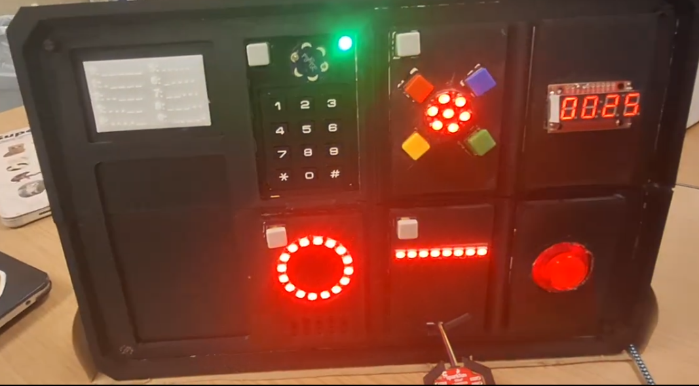

# Northwestern Micro:bit v2 Base
A prototype of an interactive bomb-defusal puzzle game built with @Yen-Wen Chen. There are different puzzles a player has to solve within a set amount of time otherwise the bomb "explodes" (the player fails the game). 

The entire game & game logic is controlled by a single Micro:bit v2 Microcontroller. 

We wrote all the required (non-blocking) drivers for all the hardware components ourselves, then integrated various hardware pieces into individual puzzles before integrating all the puzzles into the entire game.

## Components/Features:
* 4 digit 7-segment display: Displays a timer that updates every second to inform the player of how much time is remaining to solve all the puzzles. By default players have 5 minutes to complete all puzzles. 
* big red starting button: press this to start the game
* individual smaller, square, white buttons on each puzzle: press these to start a particular puzzle. Puzzles can be completed in any order and they can be interrupted at any time by starting another puzzle. Completed puzzles cannot be restarted.

The puzzles are described in clock-wise order starting from the top-left:
* Morse code puzzle: A lily buzzer buzzes a random 4 digit code in morse code, which players have to decipher using the morse code translation table in white to the left of it. Players should then input the code into the numeric keypad. If all 4 digits are correct, the LED will turn green & the puzzle is complete, otherwise it will turn red.
* Color memorization puzzle: The NeoPixel Jewel LEDs in the center displays a random sequence of colors. After the sequence is completed, players must copy the seen sequence using the colored buttons. The LEDs give feedback on both what buttons the user pressed & if they successfully completed the puzzle. They must successfully memorize 3 sequences to complete the puzzle.
* Switch state puzzle: Between the 5 switches and the 16 LEDs in the NeoPixel Ring there is a random, unknown to the player mapping. The player's job is to turn on all the LEDs by flipping the correct switches. The LEDs will turn green if the puzzle is successfully completed.
* Accelerometer Orientation Lock: There is a text-to-speech module that will give the player instructions on how to hold the accelerometer (which orientation & what angle). The player must hold the accelerometer in that position for a short amount of time (where the NeoPixel Stick LEDs show progress by lighting up) to complete a step. The player must fulfill 3 instructions given by the TTS module to complete this puzzle.

Should players successfully complete the game, all LEDs will start flashing in rainbow sequence and the TTS will say "Congratulations". Should players fail to complete the game because time runs out, the TTS will say "Boom" and all LEDs will start flashing red.



## Details
Starter code for Northwestern course CE346 based on Micro:bit v2.

This repository has applications and board initialization that connects to the
build system provided by [nrf52x-base](https://github.com/lab11/nrf52x-base).

The code written by us can be found in `/software/apps`

## Requirements
 
 1. Various tools
 
    * build-essential (make)
    * git
    * python3
    * pyserial (`sudo apt install python3-serial`)

 2. ARM cross-compiler toolchain: [gcc-arm-none-eabi toolchain](https://developer.arm.com/tools-and-software/open-source-software/developer-tools/gnu-toolchain/gnu-rm/downloads)

    On Ubuntu:

        sudo apt install gcc-arm-none-eabi

    On MacOS:

        brew tap ArmMbed/homebrew-formulae
        brew update
        brew install ARMmbed/homebrew-formulate/arm-none-eabi-gcc

 3. JTAG programming tools: OpenOCD

    On Ubuntu:

        sudo apt install openocd

    On MacOS:

        brew install open-ocd


## Installation

 * Clone the repository
 * Change directory into the repository
 * `git submodule update --init --recursive` (this will take a couple minutes to complete)


## Building and loading applications

To build an application, use `make` inside of the application's directory.

`make flash` uploads the application to the board using JTAG.

In this case, run make inside of the "apps" directory.


## Getting print data

The Micro:bit v2 prints information through a serial port at 38400 baud. You
can connect with any serial terminal, but miniterm comes with pyserial and
works pretty well for this.

```
$ pyserial-miniterm /dev/ttyACM0 38400
```

